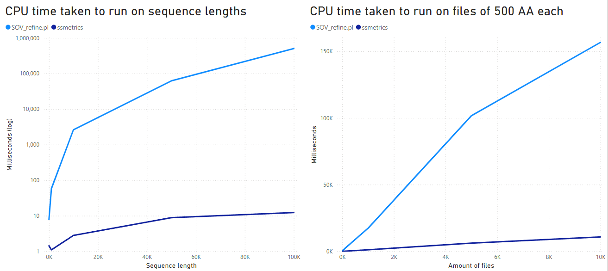

# Secondary Structure Metrics Calculator

A Windows, MacOS, and Linux application to calculate metrics commonly used for Protein Secondary Structure Prediction (PSSP) research.
The metrics that can be calculated include: Accuracy (Q3, Q8, ...), Loose Overlap, Strict Overlap, Original Segment Overlap (SOV 94), Improved Segment Overlap (SOV 99), Refined Segment Overlap (SOV Refine)

Please cite our work...

```
TBD
```

and the papers for the metric/s you utilize.

For Loose Overlap, Strict Overlap, SOV94 cite:

```
@article{ROST1994,
	title = {Redefining the goals of protein secondary structure prediction},
	journal = {Journal of Molecular Biology},
	volume = {235},
	number = {1},
	pages = {13-26},
	year = {1994},
	issn = {0022-2836},
	doi = {https://doi.org/10.1016/S0022-2836(05)80007-5},
	url = {https://www.sciencedirect.com/science/article/pii/S0022283605800075},
	author = {Burkhard Rost and Chris Sander and Reinhard Schneider},
}
```

For SOV99 cite:

```
@article{Zemla1999,
	author = {Zemla, Adam and Venclovas, Ceslovas and Fidelis, Krzysztof and Rost, Burkhard},
	title = {A modified definition of Sov, a segment-based measure for protein secondary structure prediction assessment},
	journal = {Proteins: Structure, Function, and Bioinformatics},
	volume = {34},
	number = {2},
	pages = {220-223},
	doi = {https://doi.org/10.1002/(SICI)1097-0134(19990201)34:2<220::AID-PROT7>3.0.CO;2-K},
	url = {https://onlinelibrary.wiley.com/doi/abs/10.1002/%28SICI%291097-0134%2819990201%2934%3A2%3C220%3A%3AAID-PROT7%3E3.0.CO%3B2-K},
	year = {1999}
}
```

For SOVRefine cite:

```
@article{Liu2018,
	title = {{SOV}\_refine: {A} further refined definition of segment overlap score and its significance for protein structure similarity},
	volume = {13},
	issn = {1751-0473},
	url = {https://doi.org/10.1186/s13029-018-0068-7},
	doi = {10.1186/s13029-018-0068-7},
	number = {1},
	journal = {Source Code for Biology and Medicine},
	author = {Liu, Tong and Wang, Zheng},
	year = {2018},
	pages = {1},
}
```

# Installation

For easy installation, download the zip file according to your Operating System (OS) from the [latest release](https://github.com/ivanpmartell/SecondaryStructureMetrics/releases/latest).

This will include the executable file ready to be used in your machine.

# Install from source

1. Clone this repository.
2. Obtain a C++ compiler for your OS.
3. Install [VCPkg](https://learn.microsoft.com/en-us/vcpkg/get_started/get-started?pivots=shell-cmd) following step 1 from the linked URL.
	- We suggest downloading the vcpkg repository as opposed to cloning it, since it can be slow.
	- For unix, install under `/opt/`. For Windows, install Visual Studio with the C++ workloads.
4. Configure and build the project using CMake with the preset for your OS (CMakePresets.json).
	- Alternatively, create your own preset making sure to define "CMAKE_TOOLCHAIN_FILE" with the location of vcpkg.cmake script installed from step 3.

# Usage

There are three metric calculators that can be utilized, each in it's own sub-module which can be accesssed by a subcommand.
The main module allows use of sequences (default) or fasta files as input.

```
Protein structure metric calculator
Usage: ./ssmetrics [OPTIONS] [SUBCOMMAND]

Options:
  -h,--help                   Print this help message and exit
  -f,--fasta                  Reference and predicted inputs are taken as fasta file paths

Subcommands:
  2d                          Calculate secondary structure metrics
  mutational                  Calculate mutational metrics
  binary                      Calculate two-class statistical metrics
```

The secondary structure metrics sub-module accessed by the `2d` subcommand:

```
Calculate secondary structure metrics
Usage: ./ssmetrics 2d [OPTIONS]

Options:
  -h,--help                   Print this help message and exit
  -r,--reference TEXT REQUIRED
                              Reference sequence (Add -f for fasta files)
  -p,--predicted TEXT REQUIRED
                              Predicted sequence (Add -f for fasta files)
  -m,--metric TEXT            Name of the metric to calculate. Ignore to calculate all metrics.
                              Metric Choices: Accuracy, SOV94, SOV99, SOVrefine, LooseOverlap, StrictOverlap
  -l,--lambda FLOAT           Adjustable scale parameter for SOVrefine
  -z,--zeroDelta              This will omit the delta value (delta = 0)
```

The mutational metrics sub-module accessed by the `mutational` subcommand:

```
Calculate mutational metrics
Usage: ./ssmetrics mutational [OPTIONS]

Options:
  -h,--help                   Print this help message and exit
  -r,--reference TEXT x 2     Reference consensus and mutated sequences (Add -f for fasta files)
  -p,--predicted TEXT x 2     Predicted consensus and mutated sequences (Add -f for fasta files)
  -m,--metric TEXT REQUIRED   Name of the metric to calculate.
                              Metric Choices: Accuracy, Consistency, Precision
  -l,--lambda FLOAT           Adjustable scale parameter for SOVrefine in MutationPrecision calculation
  -z,--zeroDelta              This will omit the delta value (delta = 0) in MutationPrecision calculation
  -s,--subMetric TEXT         Sub-metric to utilize in the calculation of the mutational metric.
                              Choices for consistency: Binary metrics. Choices for precision: 2d metrics
```

The binary statistics sub-module accessed by the `binary` subcommand:

```
Calculate two-class statistical metrics
Usage: ./ssmetrics binary [OPTIONS]

Options:
  -h,--help                   Print this help message and exit
  -r,--reference TEXT REQUIRED
                              Reference sequence (Add -f for fasta files)
  -p,--predicted TEXT REQUIRED
                              Predicted sequence (Add -f for fasta files)
  -m,--metric TEXT            Name of the metric to calculate. Ignore to calculate all metrics.
                              Metric Choices: Accuracy, Sensitivity, Specificity, PPV, NPV, FPR, FNR, FOR, FDR, MCC
  -c,--class CHAR REQUIRED    Positive class in your binary classification problem
```

## Example

To calculated all secondary structure metrics, you can use the following command:

```
./ssmetrics 2d -r CCHHHHHCCC -p CCCHHHHHCC
```

If using fasta files, add the fasta (`-f`) option before a subcommand. The previous command would change into:

```
./ssmetrics -f 2d -r CCHHHHHCCC -p CCCHHHHHCC
```

# Validation

We have created tests to ensure the validity of the calculations by obtaining the same results as the original papers.
These tests are performed every time a new build of the application is created.


The tests can be seen in the latest workflow run for each OS [here](https://github.com/ivanpmartell/SecondaryStructureMetrics/actions).

# Performance

This application was created as an improvement of previously existing PSSP metric calculation apps.
Most notably, our app improves the calculation speed of all metrics over the SOV_refine.pl script from the SOV_refine paper.
This performance improvement is important when calculating metrics for long sequences and also when the metrics need to be obtained for many sequences.

The results shown below were obtained using the `docs/perf_comparison.sh` script. Lower is better.

